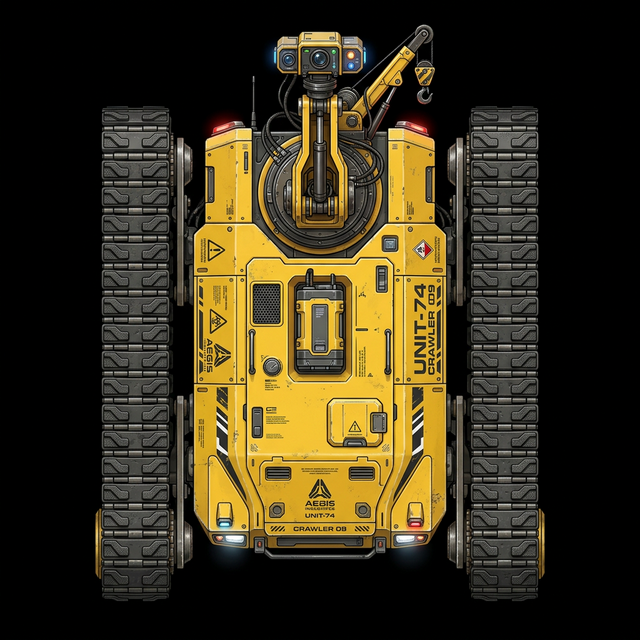

# TerraTrack-S3: Modular, Low-Profile Tracked Autonomous Robotics Platform

TerraTrack-S3 is a production-grade, modular, low-profile tracked robotics platform designed for inspection, mapping, and sensor deployment in challenging internal spaces (such as HVAC ductwork, structural crawl spaces, and industrial piping).

The system is physically built upon the **Waveshare Cobra Flex** rover chassis—a robust, drive-by-wire 4WD tracked platform featuring CNC-machined independent suspension and an integrated 1020 aluminum extrusion rail system. The software architecture implements a decoupled double-controller configuration, separating high-level perception, network gateway, and AI processing from low-level real-time actuation.



---

## 1. System Architecture

The robot's software and hardware layers are split into three primary tiers:

```
[ Electron UI Dashboard ] <=======(TCP/IP LAN)=======> [ Raspberry Pi 5 Gateway ]
                                                              ||
                                                        (115200 Baud UART)
                                                              ||
                                                              v
                                                      [ ESP32-S3 Actuator Node ]
```

1. **Frontend (Electron UI Dashboard)**:
   A translucent, glassmorphic dark-themed desktop application. It monitors local USB controllers via the Gamepad API, performs scaling and deadzone calculations, streams real-time coordinate targets, and renders telemetry and low-latency video.
2. **Gateway (Raspberry Pi 5)**:
   The primary processing core of the crawler. It hosts a TCP command server, processes IMX477 camera feeds using hardware-accelerated pipelines, controls local hardware PWM aux servos, and bridges client commands over serial.
3. **Actuator Node (ESP32-S3)**:
   A dedicated real-time micro-controller. It ingests the JSON-based command stream from the Pi to drive four independent direct-drive hub motors (DDSM400), switch auxiliary payloads, and return battery telemetry.

---

## 2. Directory Structure

The repository is organized according to the **TerraTrack-S3 Branding Blueprint**:

```
terratrack-s3/
├── docs/                      # Comprehensive technical documentation
│   ├── heterogeneous_protocol.md  # Detailed network and serial payloads
│   ├── bill_of_materials.md   # Hardware list and physical wiring guides
│   └── bench_testing_journal.md # Test records, calibration logs, and fixes
├── firmware/                  # ESP32-S3 real-time actuator source
│   ├── Cobra_Driver/          # Main Arduino/ESP-IDF source code
│   ├── libraries/             # Vendor driver dependencies (SCServo)
│   └── platformio.ini         # PlatformIO project configuration
├── gateway/                   # Raspberry Pi 5 Python application
│   ├── src/                   # Python servers, serial drivers, and camera streams
│   ├── imx500_models/         # Pre-compiled AI tracking weights
│   └── scripts/               # Linux service configuration & setup scripts
├── ui/                        # Electron desktop dashboard
│   ├── main.js                # App bootstrap & TCP network interface
│   ├── renderer.js            # Gamepad polling, DOM animation & canvas rendering
│   └── package.json           # Node configuration and dependencies
└── package.json               # Root workspace build and launch scripts
```

---

## 3. Quick Start

### 3.1 Gateway Setup (Raspberry Pi 5)
1. Ensure Raspberry Pi OS (64-bit Bookworm Lite) is installed.
2. Enable interfaces (UART, SPI, I2C) via `sudo raspi-config`.
3. Run the setup script to install dependencies:
   ```bash
   sudo chmod +x gateway/scripts/setup_pi.sh
   ./gateway/scripts/setup_pi.sh
   ```
4. Enable and start the systemd daemon for automatic startup:
   ```bash
   sudo cp gateway/scripts/hvac-crawler.service /etc/systemd/system/
   sudo systemctl daemon-reload
   sudo systemctl enable hvac-crawler.service
   sudo systemctl start hvac-crawler.service
   ```

### 3.2 Dashboard Startup (Local PC)
1. Ensure Node.js (v18+) is installed.
2. From the repository root, install dependencies and run:
   ```bash
   npm install
   npm start
   ```
3. Ensure your control PC is on the same local subnet as the robot (Default Gateway IP: `10.250.2.247`).

---

## 4. Hardware and Protocols
* **Physical Chassis**: Waveshare Cobra Flex 4WD tracked independent suspension rover.
* **Actuators**: 4x DDSM400 direct-drive FOC brushless hub motors, continuous rotation payload servo.
* **Serial Link**: UART @ 115200 baud (8N1) between Raspberry Pi 5 and ESP32-S3.
* **Communication Standard**: Waveshare UGV JSON-based Serial API.
* **Camera Stream**: TCP MJPEG stream on port `5006` with custom big-endian length headers.
* Detailed specifications can be found under the [docs/](docs/) folder.

---

## License
This project is licensed under the MIT License - see the LICENSE file for details.
