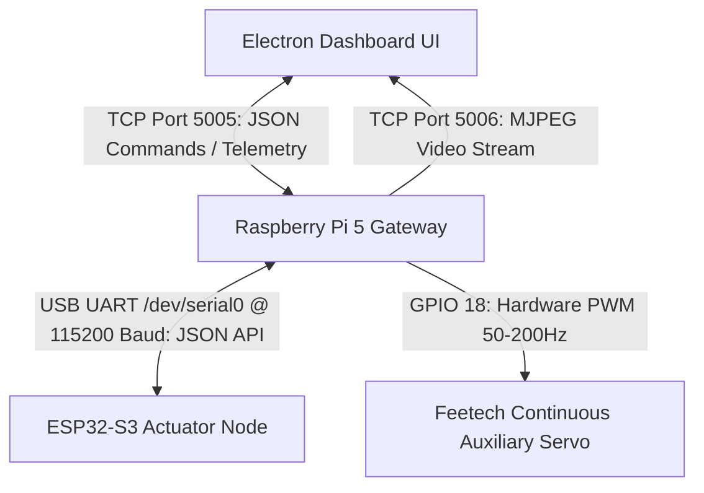

# TerraTrack-S3 Heterogeneous Communication Protocol Specification

This document details the complete end-to-end communication protocol architecture of the **TerraTrack-S3** robotics platform. The system operates on a multi-tier, heterogeneous protocol stack, decoupling high-level user interface controls from real-time low-level microcontroller actuation.

---

## 1. System Architecture Overview

The communication topology consists of three primary nodes connected via distinct network and serial buses:



---

## 2. Tier 1: Client-to-Gateway Protocol (Electron App <--> Raspberry Pi 5)

This protocol layer runs over a local area network (LAN) using standard TCP/IP. It provides a bidirectional control channel and a dedicated low-latency video streaming channel.

### 2.1 Command Channel (TCP Port 5005)
The Electron App connects to the Raspberry Pi 5 command server as a TCP client. The communication payload consists of newline-delimited (`\n`) JSON packets.

#### A. Drive & Actuation Command
Sent by the dashboard client at up to 20 Hz (throttled to 50ms intervals) to update motor speeds, headlight status, and continuous servo actuation.

- **Direction**: Client -> Gateway
- **Payload Schema**:
```json
{
  "action": "drive",
  "front_left": 150,
  "rear_left": 150,
  "front_right": -150,
  "rear_right": -150,
  "hook_speed": 0,
  "aux_speed": 128,
  "led_state": true
}
```
- **Parameter Specification**:
  - `front_left`, `rear_left`, `front_right`, `rear_right`: Integers from `-255` (Full Reverse) to `255` (Full Forward) representing the target velocity of each tread.
  - `hook_speed`: Integer from `-255` to `255` mapped to the proportional velocity of the primary hook actuator (historically driven by ESP32).
  - `aux_speed`: Integer from `-255` to `255` mapped to the Raspberry Pi's native auxiliary servo speed.
  - `led_state`: Boolean (`true` = Headlights ON, `false` = Headlights OFF).

#### B. Camera Configuration Command
Sent dynamically when the user toggles advanced camera options on the UI dashboard.

- **Direction**: Client -> Gateway
- **Payload Schemas**:
  - **IR Mode Toggle**:
    ```json
    {"action": "toggle_ir", "state": true}
    ```
    *Note: Grayscale and IR filters are applied dynamically via WebGL/CSS GPU Shaders on the UI dashboard side to eliminate hardware re-initialization latency.*
  - **HDR Mode Toggle**:
    ```json
    {"action": "toggle_hdr", "state": true}
    ```
  - **Hardware Region of Interest (RoI) Zoom**:
    ```json
    {"action": "set_roi", "level": 2.0}
    ```
    *Supported levels: 1.0 (1x FOV), 2.0 (2x Zoom).*
  - **AI Post-Processing Node Toggle**:
    ```json
    {"action": "toggle_ai", "state": false}
    ```

#### C. Keepalive Ping
Sent periodically to verify connection integrity and prevent socket timeouts.
```json
{"action": "ping"}
```

---

### 2.2 Telemetry Channel (TCP Port 5005 - Bidirectional)
The Gateway periodically transmits telemetry packets back to the connected client over the same socket connection.

- **Direction**: Gateway -> Client
- **Payload Schema**:
```json
{
  "type": "telemetry",
  "data": {
    "battery": 12.45,
    "wifi": -64
  }
}
```
- **Parameter Specification**:
  - `battery`: Float value representing the actual battery bus voltage in Volts (e.g., `12.45` for a 3S LiPo battery pack).
  - `wifi`: Integer representing the RSSI (Received Signal Strength Indication) in dBm (e.g., `-64`).

---

### 2.3 Low-Latency Video Channel (TCP Port 5006)
Upon client connection to port 5005, the Gateway initiates an MJPEG video stream.
- **Protocol**: Raw TCP Stream.
- **Payload Format**: Each frame is transmitted as a 4-byte big-endian length header followed by raw JPEG bytes.
  - `[4-Byte Big-Endian Header (Length: N)] + [N-Bytes of Raw JPEG data]`
- **Client Parsing**: The Electron client reads the 4-byte header, accumulates `N` bytes, parses the JPEG, and sets it as a Base64 data URI on an HTML5 `` element for real-time display.

---

## 3. Tier 2: Gateway-to-Actuation Serial Protocol (Pi 5 <--> ESP32-S3)

This hardware link interfaces the Raspberry Pi 5 Single Board Computer (SBC) with the ESP32-S3 real-time actuator node.
- **Physical Interface**: USB-UART or GPIO Serial (e.g., `/dev/ttyACM0` or `/dev/serial0`).
- **Configuration**: `115200` Baud, 8 Data Bits, No Parity, 1 Stop Bit (`8N1`).
- **Standard**: **Waveshare UGV JSON-based Serial API**.

### 3.1 Actuator Control Payloads (Pi -> ESP32-S3)

The Pi sends single-line JSON commands terminated by a newline (`\n`).

#### A. Dual-Track Drive Control (`T:1`)
Commands the dual-differential drive motors of the tracked chassis.
- **Command JSON**:
  ```json
  {"T": 1, "L": 150, "R": -150}
  ```
- **Parameter Specification**:
  - `T`: Instruction ID (1 = Drive Speed Loop Control).
  - `L`: Target left motor speed (`-255` to `255`).
  - `R`: Target right motor speed (`-255` to `255`).

#### B. LED Headlights / Output Switch (`T:132`)
Switches the high-power LED array on or off.
- **Command JSON**:
  ```json
  {"T": 132, "IO1": 255, "IO2": 255}
  ```
- **Parameter Specification**:
  - `T`: Instruction ID (132 = Digital Pin PWM / State Control).
  - `IO1`, `IO2`: Output switch states (`255` = ON/Full Brightness, `0` = OFF).

#### C. Hook Servo Control (`T:131`)
Controls the continuous rotation servo mounted on the boom arm.
- **Command JSON**:
  ```json
  {"T": 131, "PWM1": 90}
  ```
- **Parameter Specification**:
  - `T`: Instruction ID (131 = Servo Angle / Pulse Control).
  - `PWM1`: Position/speed coordinate. `90` represents static STOP, `0` represents full counter-clockwise speed, and `180` represents full clockwise speed.

---

### 3.2 Telemetry Feedback Payloads (ESP32-S3 -> Pi)

#### A. Battery Voltage Request (`T:130`)
The Pi requests telemetry by sending:
```json
{"T": 130}
```
The ESP32-S3 replies with:
```json
{"T": 130, "v": 1260}
```
*Note: The returned value `"v"` represents the voltage multiplied by 100 (e.g., `1260` is `12.60 V`).*

#### B. Continuous Telemetry Stream (`T:1001`)
If configured, the ESP32-S3 streams live metrics:
```json
{"T": 1001, "v": 1245, "l": 0.5, "r": -0.5}
```
*Note: `"l"` and `"r"` represent current speed feedback from the motor encoders.*

---

## 4. Tier 3: Auxiliary Actuator Protocol (Pi 5 <--> Servo)

For high-precision, low-jitter continuous rotation of auxiliary servos, the Raspberry Pi 5 bypasses the serial bus and controls the hardware directly.
- **Physical Link**: Pi 5 GPIO Pin 18 (with hardware PWM support).
- **Driver**: Powered by the system-level `pigpio` daemon or standard software-based GPIO timing.
- **PWM Parameters**:
  - **Frequency**: 50 Hz.
  - **Pulse Range**: `500 us` (Full Reverse) to `2500 us` (Full Forward).
  - **Center Stop Pulse**: `1500 us` (with hardware-level detached PWM line during idle to eliminate servo jitter).
